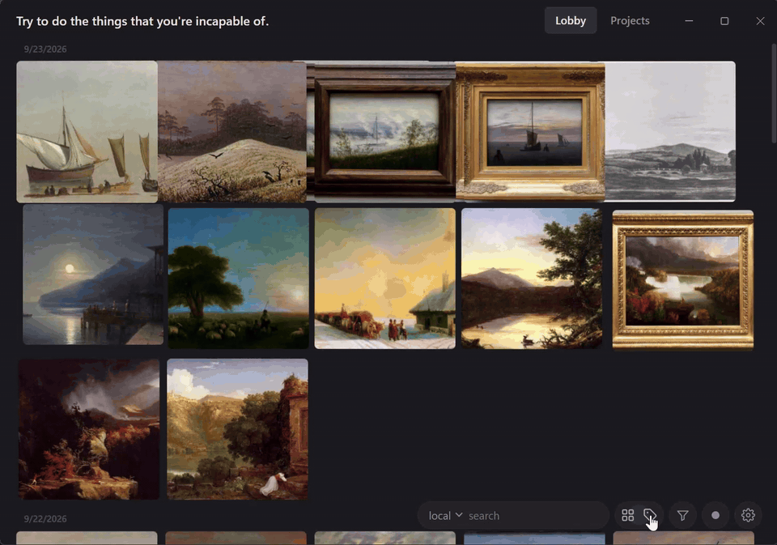

<picture>
  <source media="(prefers-color-scheme: dark)" srcset="docs/logo-dark.png">
  
</picture>

 

## Install

Download from [Releases](https://github.com/P3lerA/Epiphany/releases/latest).

**Windows**: the Setup, or the portable exe.

**macOS**: the dmg, drag Epiphany into Applications. It isn't signed: the first open is blocked, then System Settings -> Privacy & Security -> Open Anyway. Updates don't ask again. Epiphany doesn't work on Intel Macs.

After first launch, settings -> instruments -> export extension. Then "load unpacked" in Chrome extension manager.

## Use
Click pull on topright to download current image(s). Alt-S also works. Epiphany tries to lookup tags from boorus first, if they have nothing to say about that image tagger comes next.

Some websites might require login to pull images. Click the key button in settings -> sites to do so.

Hold ctrl(cmd) click/drag to select images, then do whatever you want, lookup, tag, export.

The "Profile" in settings only defines captions exported. UI will always use standard modern danboorunese.

